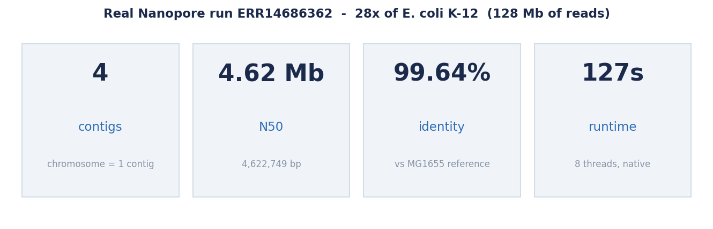
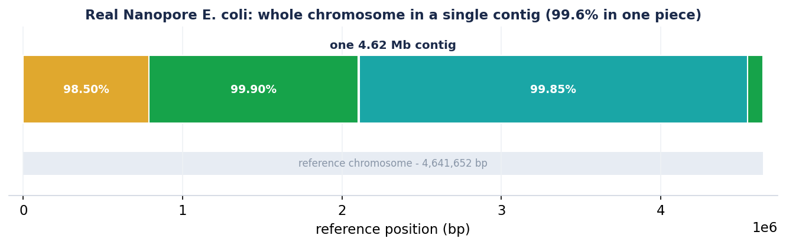
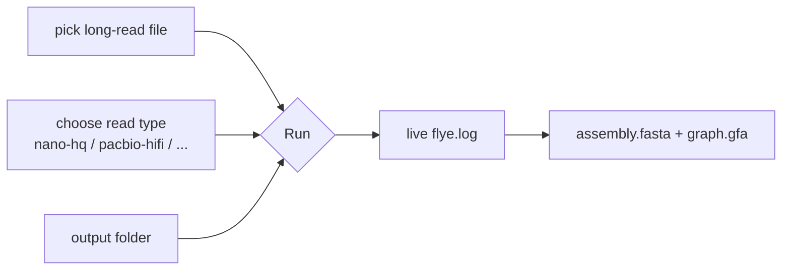
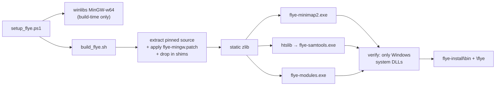
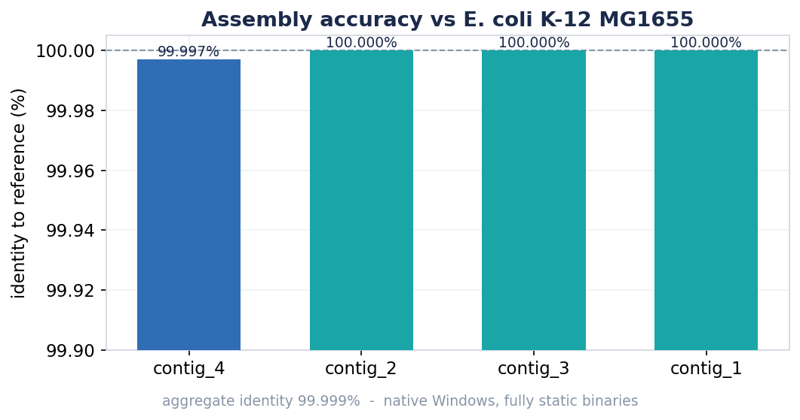
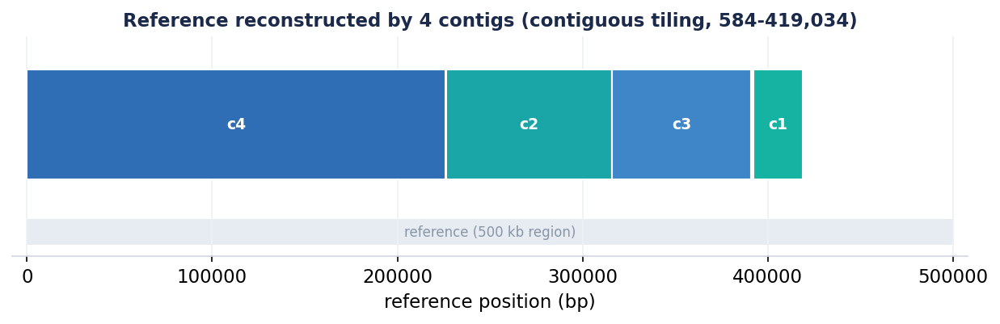

# Flye for Windows

**A native-Windows build of the [Flye](https://github.com/mikolmogorov/Flye) long-read
genome assembler — no WSL, no Docker, no Cygwin, no Linux VM.** A one-click installer,
a point-and-click GUI, and `.exe`s that run on a stock Windows 10/11 machine. Every
binary is **fully statically linked**: it depends only on DLLs that ship with Windows.

> Flye assembles long reads (Oxford Nanopore / PacBio) into complete genomes using
> repeat graphs. This repository ports its C++ core and bundled `minimap2` /
> `samtools` to compile and run natively on Windows, validates it on real Nanopore
> data, and reproduces the exact build so you can rebuild it yourself.

Ported from **Flye 2.9.6** (commit `886b8c1`). Assembler behaviour is unchanged —
this is a port, not a fork.

---

## Headline result — real Nanopore data, native Windows

A real Oxford Nanopore run ([ENA `ERR14686362`](https://www.ebi.ac.uk/ena/browser/view/ERR14686362),
~28× of *E. coli* K-12, 128 Mb of reads) assembled with `flye --nano-hq` on Windows 11:



The **entire chromosome came out as a single 4.62 Mb contig** spanning the whole
reference, at **99.64 % identity** to *E. coli* K-12 MG1655 — in about two minutes:



| metric | result |
|---|---|
| Contigs | **4** (chromosome = 1 contig of 4,622,749 bp) |
| N50 | **4.62 Mb** |
| Genome in a single contig | **99.6 %** |
| Identity vs MG1655 reference | **99.64 %** (4,637,426 / 4,654,237 bp) |
| Wall time | **~127 s** on 8 threads |
| Dependencies | only `KERNEL32`, `api-ms-win-crt-*` (UCRT), `WS2_32` |

Numbers in [`docs/ecoli_ont_metrics.json`](docs/ecoli_ont_metrics.json). A second,
tiny validation on Flye's bundled toy set is [below](#also-validated-bundled-toy-set).

---

## Install (one click)

Download **[`dist/Flye-Windows-2.9.6-Setup.exe`](dist)** and run it. That's it — the
installer bundles the assembler binaries, the Flye Python package, and a private
**embedded Python 3.11**, so nothing needs to be pre-installed. It adds a Start-Menu
app, an optional desktop shortcut, and (optionally) puts `flye` on your PATH.

It is a per-user install by default (no administrator required).

---

## Use it

### The app (for everyone)

Launch **“Flye for Windows (app)”** from the Start Menu: pick your reads, choose the
read type, pick an output folder, and click **Run**. Progress streams live; when it
finishes, **Open output folder** takes you to `assembly.fasta`.



The GUI is pure PowerShell + WinForms (built into Windows — no extra runtime); it just
drives the bundled `python bin\flye`, launched console-less via a tiny `.vbs` shim.

### The command line

If you ticked “Add Flye to my PATH”, or from the **Flye Command Prompt** shortcut:

```bat
flye --version
flye --nano-hq    reads.fastq.gz -o out_dir -t 8
flye --pacbio-hifi reads.fastq.gz -o out_dir -t 8
flye --nano-raw   reads.fastq.gz -g 5m -o out_dir -t 8 --meta
```

Read types: `--nano-raw`, `--nano-hq`, `--nano-corr`, `--pacbio-raw`,
`--pacbio-hifi`, `--pacbio-corr`. The full Flye CLI is intact (`flye --help`).
Outputs: `assembly.fasta`, `assembly_graph.gfa`, `assembly_graph.gv`,
`assembly_info.txt`, `flye.log`.

### Without installing

The repo also ships the built binaries (`bin/`) and the Flye package (`flye/`); with
any system Python 3 you can run it straight from a clone:

```powershell
python bin\flye --nano-hq reads.fastq.gz -o out_dir -t 8
```

---

## Why this exists

Flye is Unix-only: it shells out to `/bin/bash`, pipes binary BAM between `minimap2`
and `samtools`, calls glibc's `backtrace()`, and assumes an LP64 data model. None of
that works on native Windows. The usual answer is “use WSL” — a Linux VM, a separate
filesystem, a toolchain most Windows users don't have. This port makes Flye a
first-class Windows program: **three static executables** (`flye-modules.exe`,
`flye-minimap2.exe`, `flye-samtools.exe`) with no MinGW runtime DLLs to ship.

---

## How the pipeline maps onto the binaries


The C++ core embeds `minimap2` as a library for its internal overlapping; the
standalone `flye-minimap2.exe` / `flye-samtools.exe` drive the consensus/polishing
alignment.

---

## What the port changes

Small surface: **6 source files + 2 header shims**, plus a precise build recipe. Full
write-up in [`scripts/flye-patch/README.md`](scripts/flye-patch/README.md).

| Area | Fix |
|---|---|
| **LLP64** | `std::max(size_t, 1UL)` won't deduce on Windows → cast literal to `size_t` |
| **Heap corruption on real data** | the consensus aligner doubles the ksw2 band until the alignment fits; on divergent reads it reached tens of thousands and overran ksw2's SSE buffers (fatal only multi-threaded). **Cap the band at 4096** |
| **`<execinfo.h>`** | shim with no-op `backtrace()` stubs (crash handler) |
| **`<regex.h>`** | shim stubs for `samtools split`/`tview` (MinGW has no POSIX regex; Flye never calls them) |
| **`which()`** | also try `PATHEXT` so bare `flye-modules` resolves to `flye-modules.exe` |
| **`/bin/bash` pipeline** | rewritten with `subprocess` (no shell) in `alignment.py` |
| **piping BAM into `samtools sort`** | htslib can't read a binary pipe on Windows → route through a temp BAM file |
| **`shell=True` region queries** | list-form `Popen([...])` so `cmd.exe` doesn't keep the quotes |
| **minimap2 stdout** | `_setmode(_O_BINARY)` so `\n` isn't rewritten to `\r\n` and corrupts BAM |
| **build** | `-static`, `-D_FILE_OFFSET_BITS=64`, `-fcommon`, `-lpsapi`, native `G:/…` include paths |

---

## Build it yourself

A single command takes a clean Windows box to working binaries. It installs a
portable [winlibs](https://winlibs.com) MinGW-w64 toolchain (build-time only), then
compiles everything statically from the **pinned, vendored** source.

```powershell
# Requires: Git for Windows (for the bash/autoconf parts) + a Python 3.
powershell -ExecutionPolicy Bypass -File scripts\setup_flye.ps1
```

That produces a ready-to-run tree at `%LOCALAPPDATA%\flye-install`. Under the hood it
runs [`scripts/build_flye.sh`](scripts/build_flye.sh), which builds static zlib,
`flye-minimap2`, `flye-samtools` (htslib) and `flye-modules`, and verifies none of
them pull a MinGW runtime DLL.



To rebuild the installer afterwards:
`powershell -ExecutionPolicy Bypass -File scripts\installer\build_flye_installer.ps1`
(needs [Inno Setup 6](https://jrsoftware.org/isdl.php)).

---

## Also validated: bundled toy set

Flye's own `ecoli_500kb` toy reads (`flye --pacbio-corr -g 500k -m 1000`) on Windows:




4 contigs, **99.999 % aggregate identity**, contiguous tiling, ~11 s — a fast
smoke test you can run yourself:

```powershell
python bin\flye --pacbio-corr flye\tests\data\ecoli_500kb_reads_hifi.fastq.gz `
                -g 500k -o toytest -t 4 -m 1000
```

---

## Repository layout

```
Flye-for-Windows/
  dist/Flye-Windows-2.9.6-Setup.exe   one-click installer (embedded Python + GUI)
  bin/                         prebuilt static .exe + the `flye` launcher
  flye/                        the Flye Python package (patched) + toy test data
  gui/                         WinForms front-end (flye-gui.ps1) + Flye-GUI.vbs
  scripts/
    setup_flye.ps1             one-command build (PowerShell wrapper)
    build_flye.sh              the actual build recipe (bash)
    setup_toolchain.ps1        installs winlibs MinGW-w64 (build-time only)
    installer/                 flye_windows.iss + build_flye_installer.ps1
    flye-patch/
      flye-mingw.patch         the 6-file source port
      shim/execinfo.h, regex.h POSIX-header shims for MinGW
      flye-src-886b8c1.tar.gz  pinned, vendored Flye 2.9.6 source
      README.md                detailed porting notes
  docs/                        validation metrics + charts (make_charts.py)
  LICENSE                      Flye's BSD-3-Clause license
```

---

## Credits & license

Flye is by Mikhail Kolmogorov et al. — see the
[upstream repository](https://github.com/mikolmogorov/Flye) and please **cite the
Flye papers** if you use this. Bundled: `minimap2` (Heng Li), `samtools`/`htslib`
(Genome Research Ltd.). This port keeps Flye's original **BSD-3-Clause**
[license](LICENSE); the Windows patch and build scripts are offered under the same
terms. Not affiliated with or endorsed by the upstream authors.
