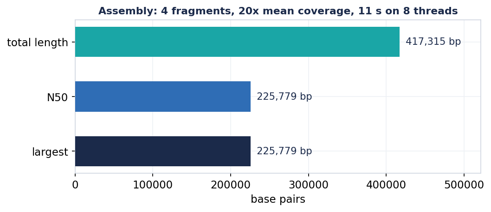
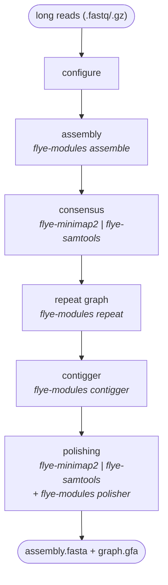

# Flye for Windows

**A native-Windows build of the [Flye](https://github.com/mikolmogorov/Flye) long-read
genome assembler — no WSL, no Docker, no Cygwin, no Linux VM.** Just `.exe`s that
run on a stock Windows 10/11 machine, plus the original Python driver. Every
binary is **fully statically linked**: it depends only on DLLs that ship with
Windows itself.

> Flye assembles long reads (Oxford Nanopore / PacBio) into complete genomes using
> repeat graphs. This repository ports its C++ core and bundled `minimap2` /
> `samtools` to compile and run natively on Windows, and reproduces the exact
> build so you can rebuild it yourself.

Ported from **Flye 2.9.6** (commit `886b8c1`). Assembler behaviour is unchanged —
this is a port, not a fork.

---

## Why this exists

Flye is Unix-only: it shells out to `/bin/bash`, pipes binary BAM between
`minimap2` and `samtools`, calls glibc's `backtrace()`, and assumes an LP64 data
model. None of that works on native Windows. The usual answer is "just use WSL" —
but that means a Linux VM, a separate filesystem, and a toolchain most Windows
users don't have. This port makes Flye a first-class Windows program.

What you get:

* **Three static executables** — `flye-modules.exe` (the C++ assembler core),
  `flye-minimap2.exe`, `flye-samtools.exe`. No `libwinpthread-1.dll`,
  `libstdc++-6.dll`, `libgcc_s_seh-1.dll`, … to ship alongside.
* **The unmodified Flye CLI** — `python bin\flye --nano-raw reads.fq -g 5m -o out`.
* **A reproducible build** — one PowerShell command, from a clean box to working
  binaries, using a pinned & vendored source so upstream changes can't break it.

---

## Validation

Assembling the bundled *E. coli* K-12 MG1655 toy set on **native Windows 11**
(`flye --pacbio-corr`, 8 threads) and aligning the result back to the reference:




| metric | result |
|---|---|
| Contigs | **4** |
| Aggregate identity to reference | **99.999 %** (3 contigs at 100.000 %) |
| Reference span reconstructed | 584 – 419,034, **contiguous tiling** |
| Total length / N50 | 417,315 bp / 225,779 bp |
| Mean coverage | 20× |
| Wall time | **~11 s** on 8 threads |
| Binary dependencies | only `KERNEL32`, `api-ms-win-crt-*` (UCRT), `WS2_32` |

The ~83 % of the 500 kb reference covered is simply because the toy read set only
spans ~417 kb of it — the contigs reconstruct essentially **100 % of what the
reads cover**, at near-perfect identity. Numbers in
[`docs/ecoli_500kb_metrics.json`](docs/ecoli_500kb_metrics.json); charts
regenerate with [`docs/make_charts.py`](docs/make_charts.py).

---

## Quick start (prebuilt)

The repository ships the built static binaries (`bin/`) and the Flye Python
package (`flye/`). You only need a **Python 3** interpreter on PATH.

```powershell
# from the repo root
python bin\flye --version

# built-in toy test (bundled E. coli reads)
python bin\flye --pacbio-corr flye\tests\data\ecoli_500kb_reads_hifi.fastq.gz `
                -g 500k -o toytest -t 4 -m 1000

# a real run
python bin\flye --nano-raw  yourreads.fastq.gz -g 5m -o out_dir -t 8
python bin\flye --pacbio-hifi yourreads.fastq.gz       -o out_dir -t 8
```

Outputs land in the `-o` directory: `assembly.fasta`, `assembly_graph.gfa`,
`assembly_graph.gv`, `assembly_info.txt`, plus per-stage working dirs.

Read types: `--nano-raw`, `--nano-hq`, `--nano-corr`, `--pacbio-raw`,
`--pacbio-corr`, `--pacbio-hifi` (and `--meta`, `--keep-haplotypes`, etc. — the
full Flye CLI is intact; see `python bin\flye --help`).

---

## Build it yourself

A single command takes a clean Windows box to working binaries. It installs a
portable [winlibs](https://winlibs.com) MinGW-w64 toolchain (build-time only),
then compiles everything statically from the **pinned, vendored** source.

```powershell
# Requires: Git for Windows (for the bash/autoconf parts) + a Python 3.
powershell -ExecutionPolicy Bypass -File scripts\setup_flye.ps1
```

That produces a ready-to-run tree at `%LOCALAPPDATA%\flye-install` (`bin\` +
`flye\`). Under the hood it runs [`scripts/build_flye.sh`](scripts/build_flye.sh),
which builds static zlib, `flye-minimap2`, `flye-samtools` (htslib) and
`flye-modules`, and verifies none of them pull a MinGW runtime DLL.


---

## How the pipeline maps onto the binaries



The C++ core embeds `minimap2` as a library for its internal overlapping; the
standalone `flye-minimap2.exe` / `flye-samtools.exe` are used by the
consensus/polishing alignment step.

---

## What the port changes

Small surface: **5 source files + 2 header shims**, plus a precise build recipe.
Full write-up in [`scripts/flye-patch/README.md`](scripts/flye-patch/README.md).

| Area | Fix |
|---|---|
| **LLP64** | `std::max(size_t, 1UL)` won't deduce on Windows -> cast literal to `size_t` |
| **`<execinfo.h>`** | shim with no-op `backtrace()` stubs (crash handler) |
| **`<regex.h>`** | shim stubs for `samtools split`/`tview` (MinGW has no POSIX regex; Flye never calls them) |
| **`which()`** | also try `PATHEXT` so bare `flye-modules` resolves to `flye-modules.exe` |
| **`/bin/bash` pipeline** | rewritten with `subprocess` (no shell) in `alignment.py` |
| **piping BAM into `samtools sort`** | htslib can't read a binary pipe on Windows -> route through a temp BAM file |
| **`shell=True` region queries** | list-form `Popen([...])` so `cmd.exe` doesn't keep the quotes |
| **minimap2 stdout** | `_setmode(_O_BINARY)` so `\n` isn't rewritten to `\r\n` and corrupts BAM |
| **build** | `-static`, `-D_FILE_OFFSET_BITS=64`, `-fcommon`, `-lpsapi`, native `G:/…` include paths |

---

## Repository layout

```
Flye-for-Windows/
  bin/                         prebuilt static .exe + the `flye` launcher
  flye/                        the Flye Python package (patched) + toy test data
  scripts/
    setup_flye.ps1             one-command build (PowerShell wrapper)
    build_flye.sh              the actual build recipe (bash)
    setup_toolchain.ps1        installs winlibs MinGW-w64 (build-time only)
    flye-patch/
      flye-mingw.patch         the 5-file source port
      shim/execinfo.h          POSIX-header shims for MinGW
      shim/regex.h
      flye-src-886b8c1.tar.gz  pinned, vendored Flye 2.9.6 source
      README.md                detailed porting notes
  docs/                        validation metrics + charts
  LICENSE                      Flye's BSD-3-Clause license
```

---

## Credits & license

Flye is by Mikhail Kolmogorov et al. — see the
[upstream repository](https://github.com/mikolmogorov/Flye) and please **cite the
Flye papers** if you use this. Bundled: `minimap2` (Heng Li), `samtools`/`htslib`
(Genome Research Ltd.). This port keeps Flye's original **BSD-3-Clause**
[license](LICENSE); the Windows patch and build scripts are offered under the same
terms. Not affiliated with or endorsed by the upstream authors.
